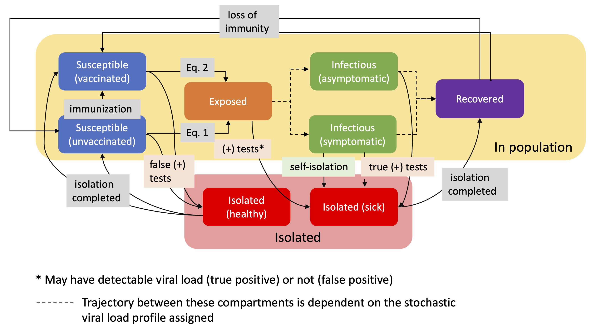

# Simulations for Infection Control Operations (SICO)

Distribution A. Approved for public release: distribution unlimited. Case Number AFRL-2023-5280.

## Overview 
This tool allows users to simulate and compare control strategies for mitigation of disease spread in a population. For more information, see the preprint on arXiv: [Simulations for Infection Control Operations (SICO)](https://arxiv.org/pdf/2308.09852.pdf).

## Model
### Disease Model 
- Modularized structure enables tuning to disease specifics

- Simulate individual viral load to account for differences in agent disease response 

### Testing 
- Ability to compare disease evolution across various values for
  - test response time
  - testing frequency
  - test limit of detection (LOD)
  - false positive and false negative rate
  - pool size

### Vaccination
- Simulate the impact of various rates of vaccination on the disease propagation

## Contributors

* Karleigh Pine - Matrix Research 
* Razvan Veliche - Keystone Strategy, LLC. (work completed while affiliated with Mobius Logic) 
* Jared Bennett - Mobius Logic 
* Joel Klipfel - Matrix Research 

## Acknowledgement
This project has been funded by the Air Force Research Lab (AFRL) Autonomy Capability Team 3 (ACT3) under contracts FA8650-20-C-1121 and FA8649-20-C-0130. 

